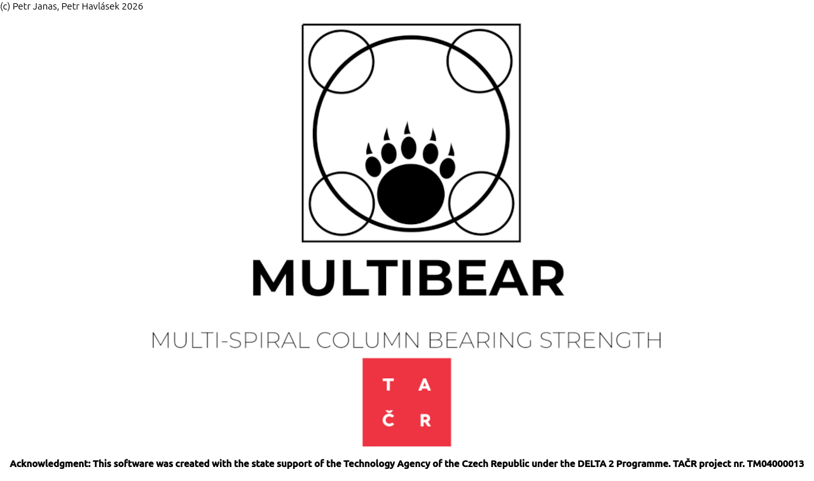

# MULTIBEAR
[](https://www.gnu.org/licenses/old-licenses/lgpl-2.1.html)

MULTIBEAR is a specialized software tool designed for the modeling, simulation, and design of the Multi-spiral Reinforced Concrete-Steel (New-MRCS) structural system. It specifically addresses the bearing strength of concrete columns reinforced with Multi-Spiral Reinforcement (MSR) under partial-area loading at the free edge. By facilitating a direct comparison between New-MRCS and conventional RCS systems, the program allows users to quantify the structural benefits and material savings achieved through the enhanced confinement provided by advanced reinforcement topologies.

The software features an intuitive Graphical User Interface (GUI) that streamlines the design and verification of transverse reinforcement. While the interface enables the rapid generation of interaction diagrams—without requiring the user to have extensive expertise in non-linear finite element analysis—the underlying computational engine ensures high-fidelity results. MULTIBEAR bridges analytical design with advanced structural research by automating the verification of interaction diagrams through integrated non-linear simulations powered by the open-source OOFEM finite element package. This dual-layer approach provides engineers with both the efficiency of rapid design and the structural reliability of a validated numerical framework.


## Licensing
MULTIBEAR is free for educational and research purposes. It is distributed under the terms of the GNU Lesser General Public License (LGPL) version 2.1 or later. For commercial licensing inquiries, please contact the developer.

Copyright (C) 2026 Petr Havlásek




### Pre-requisites

* In addition to standard Python 3.x, the following dependencies are required:
```
$ pip3 install PySide2
```
* OOFEM configuration with following flags turned ON:
```
USE_DSS (Direct Sparse Solver)
USE_OPENMP (Multi-threading support)
USE_PYBIND_BINDINGS (Python interface for solver execution)
```
## Running MULTIBEAR
To launch the application, execute:

```
$ python3 multibear.py
```

## Documentation	
MULTIBEAR Program documentation is available [here](multibear_documentation.pdf).
3

## Authors
[Petr Havlásek](mailto:petr.havlasek@cvut.cz), [ORCID: 0000-0002-7128-3664](https://orcid.org/0000-0002-7128-3664)<br/>
[Petr Janas](mailto:janaspe2@student.cvut.cz)

## Acknowledgments
Financial support for this work was provided by the Technology Agency of the Czech Republic (TAČR), project number TM04000013
(Virtual prototyping for green concrete structural design – new multi-spiral reinforced concrete column and steel beam structures).
